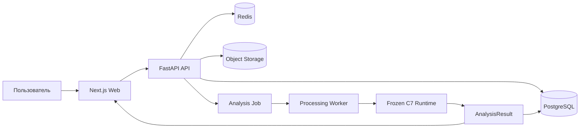

# BoneQC

**BoneQC** — система автоматического технического контроля качества DXA-исследований в формате DICOM.

Проект разработан командой **ХМ ЛАБ** для хакатона 2026.

BoneQC определяет поддерживаемую анатомическую область, оценивает техническое качество исследования, выявляет поддерживаемые нарушения и формирует структурированный результат.

> BoneQC выполняет технический QC. Система не диагностирует остеопороз и не заменяет медицинское заключение.

## Обзор решения

Подробное описание продукта, ML-архитектуры, конкурсного runtime, validation и ограничений:

**[docs/SOLUTION_OVERVIEW.md](docs/SOLUTION_OVERVIEW.md)**

## Поддерживаемые области

```text
SPINE
LEFT_HIP
RIGHT_HIP
```

Для позвоночника контролируются:

- корректность позиционирования;
- отклонение оси;
- посторонние объекты и выраженные артефакты.

Для проксимального отдела бедра:

- позиционирование и ротация;
- область интереса;
- поле обзора.

## Архитектура



Продуктовый слой и frozen ML runtime разделены: изменение интерфейса, API, БД или экспертного workflow не должно неявно изменять frozen C7.

Подробнее: [docs/architecture/ARCHITECTURE.md](docs/architecture/ARCHITECTURE.md)

## Frozen C7

```text
SPINE
  positioning → BiomedCLIP
  axis        → deterministic geometry
  artifact    → RAD-DINO

HIP
  positioning / rotation → ResNet18 + C2
  ROI / FOV              → geometry/FOV specialist
  aggregate hip QC       → geometry + RAD-DINO
```

C8 challenger не прошёл promotion gate.

```text
NO_C8_PROMOTION_KEEP_C7
```

## Результат

```text
quality_class = 0 → PASS
quality_class = 1 → FAIL
```

Дополнительно используются:

```text
violation_type
quality_prob
processing_status
time_of_processing
```

`quality_prob` — непрерывный QC score. Он не является accuracy, вероятностью диагноза или самостоятельным правилом PASS/FAIL.

## Validation

Frozen C7 one-time validation:

```text
49 изображений
20 исследований
```

| Метрика | Значение |
|---|---:|
| Sensitivity | 0.5000 |
| Specificity | 0.8571 |
| Balanced accuracy | 0.6786 |
| F1 | 0.5385 |
| ROC-AUC | 0.7143 |
| PR-AUC | 0.6567 |

Подробнее: [docs/ml/VALIDATION.md](docs/ml/VALIDATION.md)

## Структура репозитория

```text
apps/
  api/          FastAPI backend, worker, migrations, tests
  web/          Next.js web interface
  ai-engine/    product AI-provider service boundary
docs/           public technical and competition documentation
evaluator/      competition wrapper and judge preflight
infrastructure/ deployment/integration helpers
ml/             ML-facing project documentation
compose.yaml    local product stack
.env.example    configuration template
```

Frozen competition C7 поставляется отдельно как immutable runtime и не смешивается с изменяемым product code.

## Зависимости

### Product backend

`apps/api/pyproject.toml` использует Python `>=3.12,<3.13`.

Ключевые зависимости:

```text
FastAPI >=0.115,<1.0
Uvicorn >=0.34,<1.0
Pydantic >=2.10,<3.0
SQLAlchemy >=2.0,<3.0
asyncpg >=0.30,<1.0
Alembic >=1.14,<2.0
boto3 >=1.35,<2.0
redis >=8.0,<9.0
httpx >=0.28,<1.0
pydicom >=3.0.2,<4.0
numpy >=2.5.3,<3.0
Pillow >=12.3,<13.0
```

### Web

`apps/web/package.json`:

```text
Next.js 16.3.3
React 19.3.0
React DOM 19.3.0
TypeScript 5.9.x
```

### Product infrastructure

`compose.yaml` использует:

```text
PostgreSQL 17
Redis 8-alpine
SeaweedFS 4.46
```

### Frozen C7 runtime

Authoritative competition runtime использует отдельный pinned environment. Основной стек включает PyTorch `2.14.0+cu130`, torchvision `0.29.0+cu130`, pydicom `3.0.2` и frozen model dependencies/artifacts. Полный resolved environment и SHA256 manifest входят в frozen runtime package.

## Локальный запуск product stack

Создать локальную конфигурацию:

```bash
cp .env.example .env
```

Заполнить обязательные local secrets/credentials, затем:

```bash
docker compose config
docker compose up -d --build
docker compose ps
```

Логи:

```bash
docker compose logs -f api worker web
```

Остановка:

```bash
docker compose down
```

Product stack по умолчанию отделён от authoritative competition C7. Для product-интеграции с C7 gateway требуется соответствующая локальная конфигурация runtime/gateway.

## Preprocessing и postprocessing

Competition path:

```text
input
→ safe ZIP handling / DICOM discovery
→ staging + manifest
→ frozen C7 DICOM preprocessing
→ anatomy routing
→ specialist inference
→ locked aggregation
→ CSV/XLSX
→ source-path restore
→ evaluator audit
```

Product path дополнительно включает validation, privacy/de-identification и private object storage до передачи подготовленного DICOM в ML boundary.

Preview PNG/JPEG не используется как ML input.

## Известные ошибки и fail-safe поведение

- если DICOM не найден, evaluator завершает запуск с ошибкой;
- повреждённый DICOM-кандидат не исчезает молча и получает `processing_status = Failure`;
- обычный non-DICOM файл внутри batch игнорируется;
- неожиданный non-zero exit frozen runtime считается ошибкой;
- frozen C7 review-exit для mixed Success/Failure batch принимается только при наличии требуемых output artifacts и зафиксированных failure rows;
- несовпадение числа input/output rows, source paths или обязательных колонок приводит к evaluator failure;
- processing failure не интерпретируется как PASS.

## Competition evaluator

Поддерживаемый вход:

- DICOM file;
- directory;
- ZIP archive.

Preflight:

```bash
bash evaluator/judge_preflight.sh
```

Запуск:

```bash
python3 evaluator/boneqc_evaluator.py INPUT OUTPUT_DIR
```

Выход:

```text
boneqc-c7-results-v1.csv
boneqc-c7-results-v1.xlsx
boneqc-evaluator-manifest-v1.json
boneqc-evaluator-audit-v1.json
```

Строгий конкурсный контракт:

```text
path_to_study
study_uid
image_uid
anatomical_region
quality_class
violation_type
processing_status
time_of_processing
```

Подробнее: [docs/competition/JUDGE_QUICKSTART.md](docs/competition/JUDGE_QUICKSTART.md)

## Batch API

Frozen submission runtime содержит локальный HTTP batch API:

```text
GET  /health/live
GET  /health/ready
POST /v1/batch
```

API использует тот же frozen C7 и не содержит отдельной ML-логики.

## Immutable runtime

```text
ghcr.io/xaltezzarx/boneqc-c7@
sha256:d67b6a3c695a0cd495e5fd7c31e4d5f2142d13452afec4e304e2f01c9fc045d7
```

Inference выполняется без сетевого доступа.

Веса, thresholds, model selection и output semantics frozen.

## Hardware

Проверенный основной GPU:

```text
NVIDIA GeForce RTX 3080 10 GB
```

Compatibility/fallback runtime также проверялся на GTX 1060 6 GB.

Frozen runtime использует стек с поддержкой Hopper `sm_90` и архитектурно совместим с NVIDIA H200.

Физический benchmark на H200 командой не выполнялся.

## Документация

- [Solution Overview](docs/SOLUTION_OVERVIEW.md)
- [Architecture](docs/architecture/ARCHITECTURE.md)
- [Clinical Workflow](docs/clinical/CLINICAL_WORKFLOW.md)
- [API](docs/api/API.md)
- [User Guide](docs/USER_GUIDE.md)
- [Model Card](docs/ml/MODEL_CARD.md)
- [Validation](docs/ml/VALIDATION.md)
- [Dataset and Splits](docs/ml/DATASET_AND_SPLITS.md)
- [Experiment History](docs/ml/EXPERIMENT_HISTORY.md)
- [Training / Fine-tuning](docs/ml/TRAINING_AND_FINETUNING.md)
- [Deployment](docs/operations/DEPLOYMENT.md)
- [Privacy and Security](docs/security/PRIVACY_AND_SECURITY.md)
- [Judge Quickstart](docs/competition/JUDGE_QUICKSTART.md)
- [Frozen C7 Reproducibility](docs/competition/FROZEN_C7_REPRODUCIBILITY.md)
- [Evaluator README](evaluator/README.md)

## Статус

```text
Final ML architecture: C7
Model selection: frozen
Thresholds: frozen
C8 promotion: rejected
```

BoneQC — исследовательский и конкурсный прототип технического QC DXA.
