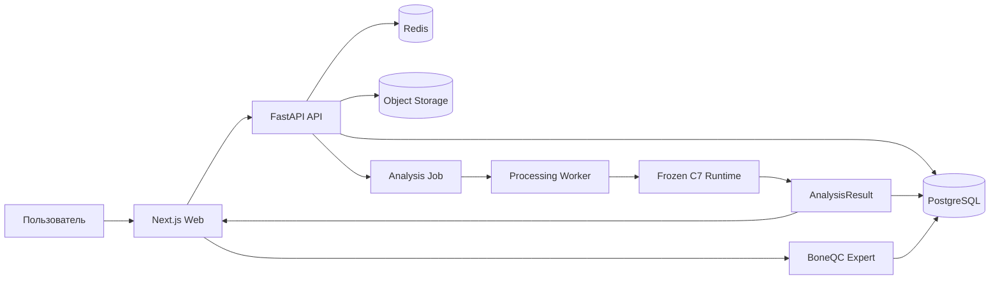
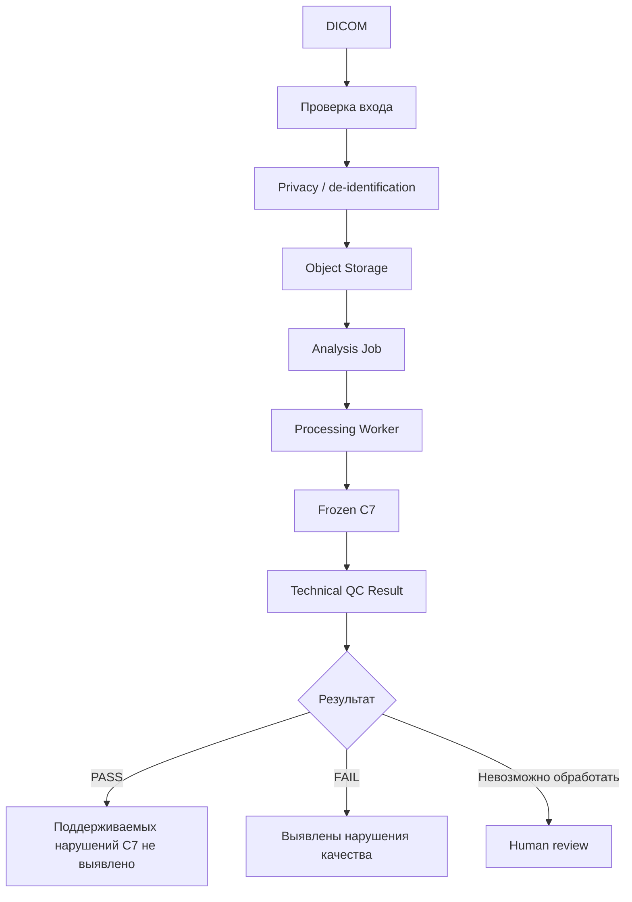
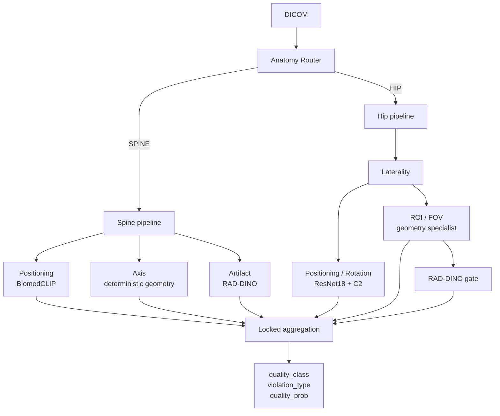
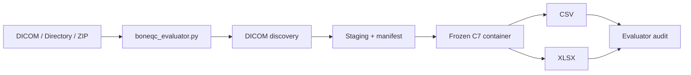
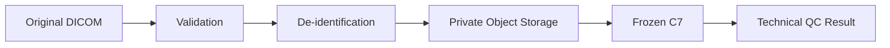
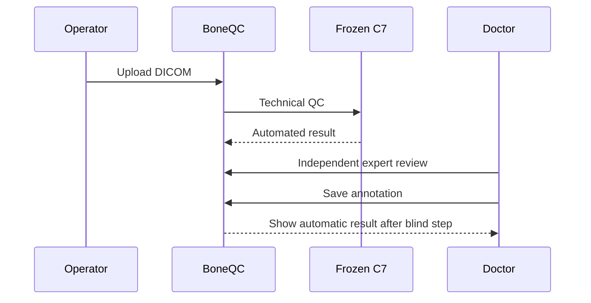

# BoneQC — обзор решения

## 1. Что такое BoneQC

**BoneQC** — система автоматического технического контроля качества DXA-исследований в формате DICOM.

Проект разработан командой **ХМ ЛАБ** для хакатона 2026.

BoneQC решает задачу контроля качества выполнения исследования до дальнейшей врачебной интерпретации:

- определяет поддерживаемую анатомическую область;
- выполняет технический QC;
- выявляет поддерживаемые типы нарушений;
- формирует структурированный результат;
- предоставляет автономный конкурсный evaluator;
- поддерживает независимую экспертную оценку в продуктовом контуре.

BoneQC **не ставит диагноз**, не определяет наличие остеопороза и не заменяет медицинское заключение врача.

## 2. Поддерживаемые анатомические области

```text
SPINE
LEFT_HIP
RIGHT_HIP
```

Это соответствует двум основным областям конкурсного кейса:

- поясничный отдел позвоночника;
- проксимальный отдел бедренной кости.

Для исследований бедра дополнительно определяется сторона.

## 3. Контролируемые нарушения

### 3.1 Позвоночник

Кейс предусматривает контроль:

- корректности области сканирования и укладки;
- положения позвоночника относительно вертикальной оси;
- отсутствия посторонних объектов и значимых артефактов.

Для оси позвоночника в критериях кейса используется предел отклонения до 5°.

Frozen C7:

```text
positioning → BiomedCLIP
axis        → deterministic geometry
artifact    → RAD-DINO
```

### 3.2 Проксимальный отдел бедра

Кейс предусматривает контроль:

- корректности позиционирования;
- ротации;
- видимости анатомических ориентиров;
- достаточности области интереса и поля обзора.

Frozen C7:

```text
positioning / rotation → ResNet18 + C2
ROI / FOV              → geometry/FOV specialist
aggregate hip QC       → geometry + RAD-DINO
```

Физические критерии конкурсного задания и внутренние ML-сигналы BoneQC необходимо различать.

Например, конкурсные требования к полю обзора задаются в физических единицах. BoneQC не заявляет прямое физическое измерение расстояния в сантиметрах для каждого DICOM, если необходимые spatial metadata отсутствуют.

## 4. Два контура BoneQC

### Product contour

```text
Web
FastAPI
PostgreSQL
Redis
Object Storage
Processing Worker
Frozen C7
Expert workflow
```

### Competition contour

```text
DICOM / directory / ZIP
Evaluator
Frozen C7
CSV / XLSX
Manifest
Audit
Batch HTTP API
```

Конкурсный контур не зависит от полного web-продукта и может использоваться автономно.

## 5. Общая архитектура продукта



Продуктовый слой и frozen ML runtime разделены.

## 6. Жизненный цикл исследования



Preview, отображаемое в браузере, не является входом frozen C7. ML получает подготовленный DICOM.

## 7. Frozen C7

C7 — финальная конкурсная ML-архитектура BoneQC. Это не один универсальный classifier, а набор специализированных компонентов и фиксированных правил агрегации.



Во frozen C7 зафиксированы model selection, model artifacts, weights, thresholds, specialist decisions, aggregation logic, output semantics и inference runner.

После one-time validation C7 не перенастраивался по её результатам.

## 8. Почему C7, а не C8

После C7 исследовались challenger-подходы C8: Noisy-OR, logistic stacker, score-only alternative, direct overall QC head, patch-token RAD-DINO и дополнительные geometry/synthetic направления.

Promotion gate не подтвердил улучшение.

```text
NO_C8_PROMOTION_KEEP_C7
```

C8 не используется для ретроспективной корректировки C7.

Подробнее: [EXPERIMENT_HISTORY.md](ml/EXPERIMENT_HISTORY.md)

## 9. Формирование результата

```text
quality_class = 0 → PASS
quality_class = 1 → FAIL
```

`quality_class` формируется из frozen subtype decisions и не вычисляется простым правилом `quality_prob >= 0.5`.

`quality_prob` — дополнительный непрерывный QC score. Он не является accuracy, процентом качества исследования, вероятностью диагноза, вероятностью того, что модель права, или заявленной клинически откалиброванной вероятностью.

`violation_type` содержит поддерживаемый тип или набор типов выявленных нарушений.

`processing_status` отделён от QC result. Ошибка отдельного файла должна фиксироваться как техническая ошибка обработки, а не интерпретироваться как PASS.

## 10. Конкурсный evaluator



Evaluator:

- принимает отдельный DICOM-файл, каталог или ZIP;
- обнаруживает DICOM по содержимому;
- сохраняет исходные относительные пути;
- запускает exact immutable C7 image;
- выполняет inference без сетевого доступа;
- формирует CSV/XLSX;
- создаёт manifest и audit;
- сохраняет отдельную `Failure`-строку для повреждённого DICOM-кандидата;
- игнорирует обычные non-DICOM файлы в batch.

## 11. Обязательный output contract

```text
path_to_study
study_uid
image_uid
anatomical_region
quality_class
violation_type
processing_status
time_of_processing
```

Дополнительно runtime сохраняет `quality_prob`.

Для успешно обработанных изображений используется `processing_status = Success`; если отдельный DICOM невозможно корректно обработать — `processing_status = Failure`.

Ошибка одного файла не должна приводить к его молчаливому исчезновению из результата.

## 12. Batch HTTP API

Frozen submission runtime содержит локальный batch API:

```text
POST /v1/batch
GET /health/live
GET /health/ready
```

API запускает тот же frozen C7 runner и тот же submission adapter.

## 13. Runtime isolation

Authoritative image:

```text
ghcr.io/xaltezzarx/boneqc-c7@
sha256:d67b6a3c695a0cd495e5fd7c31e4d5f2142d13452afec4e304e2f01c9fc045d7
```

Во время inference контейнер запускается без сетевого доступа.

## 14. Аппаратная совместимость

Основной проверенный GPU:

```text
NVIDIA GeForce RTX 3080 10 GB
```

Дополнительно проверялся compatibility/fallback runtime на GTX 1060 6 GB.

Для frozen 49-case replay semantic mismatches = 0 и class flips = 0.

Authoritative runtime использует Linux amd64 PyTorch/CUDA stack с поддержкой Hopper `sm_90`, то есть архитектурно совместим с NVIDIA H200. Физический benchmark на H200 командой не выполнялся.

## 15. Validation C7

One-time validation:

```text
49 изображений
20 исследований
```

| Метрика | Значение |
|---|---:|
| Sensitivity | 0.5000 |
| Specificity | 0.8571 |
| Balanced accuracy | 0.6786 |
| F1 | 0.5385 |
| ROC-AUC | 0.7143 |
| PR-AUC | 0.6567 |

Confusion matrix:

```text
TP = 7
FP = 5
TN = 30
FN = 7
```

Study-cluster bootstrap 95% CI:

| Метрика | 95% CI |
|---|---|
| Sensitivity | 0.2500–0.8750 |
| Specificity | 0.7419–0.9556 |
| F1 | 0.3000–0.7586 |
| Balanced accuracy | 0.5377–0.8683 |
| ROC-AUC | 0.4907–0.9460 |
| PR-AUC | 0.3859–0.8666 |

95% confidence interval не означает 95% accuracy.

Подробнее: [VALIDATION.md](ml/VALIDATION.md)

## 16. Privacy boundary



В продуктовом контуре медицинские изображения не должны передаваться во внешние AI API или закрытые внешние сервисы.

Подробнее: [PRIVACY_AND_SECURITY.md](security/PRIVACY_AND_SECURITY.md)

## 17. Экспертный контур



Экспертная оценка не изменяет C7, thresholds и model selection и хранится отдельно от automatic result.

## 18. Ограничения

- небольшое число positive cases для некоторых subtype нарушений;
- class imbalance;
- поддерживаются только заявленные анатомические области;
- отсутствует внешняя многоцентровая clinical validation;
- не оценена inter-reader agreement;
- physical FOV criteria не всегда могут быть измерены напрямую из-за неполных spatial metadata;
- H200 совместимость подтверждена архитектурно, но не физическим benchmark;
- прототип не является зарегистрированным медицинским изделием.

## 19. Карта документации

- [Architecture](architecture/ARCHITECTURE.md)
- [Clinical workflow](clinical/CLINICAL_WORKFLOW.md)
- [API](api/API.md)
- [User guide](USER_GUIDE.md)
- [Model Card](ml/MODEL_CARD.md)
- [Validation](ml/VALIDATION.md)
- [Dataset and splits](ml/DATASET_AND_SPLITS.md)
- [Experiment history](ml/EXPERIMENT_HISTORY.md)
- [Training / fine-tuning](ml/TRAINING_AND_FINETUNING.md)
- [Deployment](operations/DEPLOYMENT.md)
- [Privacy and security](security/PRIVACY_AND_SECURITY.md)
- [Judge Quickstart](competition/JUDGE_QUICKSTART.md)
- [Frozen C7 reproducibility](competition/FROZEN_C7_REPRODUCIBILITY.md)
- [Evaluator README](../evaluator/README.md)

## 20. Текущий статус

```text
Final ML architecture: C7
C8 promotion: rejected
Model selection: frozen
Thresholds: frozen
Competition runtime: immutable
```

BoneQC остаётся исследовательским и конкурсным прототипом технического контроля качества DXA.
