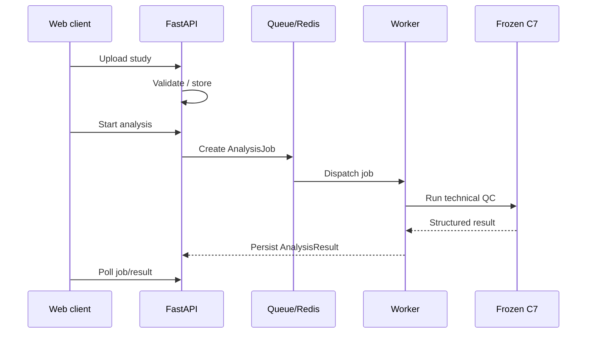

# API BoneQC

## 1. Назначение

В BoneQC есть два API-контура:

1. продуктовый FastAPI API;
2. локальный competition batch API, входящий во frozen submission runtime.

Эти контуры решают разные задачи и не должны смешиваться.

## 2. Product API

Продуктовый backend реализован на FastAPI и использует пространство:

```text
/api/v1
```

Он обслуживает:

- authentication;
- RBAC;
- studies;
- DICOM upload;
- analysis jobs;
- results;
- expert annotations;
- audit;
- административные функции.

## 3. Роли

```text
ADMIN
OPERATOR
DOCTOR
```

### ADMIN

Администрирование системы и пользователей.

### OPERATOR

Загрузка исследований, запуск анализа и просмотр разрешённых результатов.

### DOCTOR

Независимая экспертная оценка и сохранение annotations.

## 4. Жизненный цикл анализа



ML inference выполняется асинхронно через worker.

HTTP request не должен оставаться открытым на всё время inference.

## 5. Product result semantics

Основные поля automatic result:

```text
anatomical_region
quality_class
quality_prob
violation_type
processing_status
```

`quality_class`:

```text
0 → PASS
1 → FAIL
```

`quality_prob` — непрерывный QC score frozen C7.

Он не является accuracy или заявленной клинически откалиброванной вероятностью.

`processing_status` отражает технический статус обработки и не должен подменяться PASS.

## 6. Expert annotations

Экспертный API хранит независимую оценку врача отдельно от automatic result.

Поддерживаются:

- categorical labels;
- комментарии;
- geometry annotations;
- blind-review flow;
- состояние невозможности экспертной оценки.

Expert annotation не изменяет frozen C7.

## 7. Competition batch API

Frozen submission runtime содержит отдельный локальный HTTP API.

Health endpoints:

```text
GET /health/live
GET /health/ready
```

Batch endpoint:

```text
POST /v1/batch
```

API работает с mounted input/output directories и запускает тот же frozen C7 runner и тот же submission adapter, что и CLI submission path.

Отдельной ML-модели для HTTP API нет.

## 8. Batch concurrency

Competition batch API использует single-flight execution.

Если batch уже выполняется, параллельный запрос может быть отклонён с HTTP `409`.

Это защищает GPU/runtime от неявного параллельного запуска нескольких тяжёлых inference jobs.

## 9. Batch error semantics

Для входного batch:

- успешный DICOM получает `processing_status = Success`;
- повреждённый DICOM-кандидат остаётся в output и получает `processing_status = Failure`;
- обычные non-DICOM файлы не считаются исследованиями.

Ошибка отдельного файла не должна приводить к молчаливому исчезновению этого входа из отчёта.

## 10. Competition output contract

Обязательные поля:

```text
path_to_study
study_uid
image_uid
anatomical_region
quality_class
violation_type
processing_status
time_of_processing
```

Дополнительное поле extended output:

```text
quality_prob
```

## 11. Security boundary

Product API должен обеспечивать:

- authentication;
- RBAC;
- проверку доступа к studies;
- безопасную обработку DICOM;
- разграничение automatic/expert data;
- отсутствие production secrets в публичном репозитории.

Competition API предназначен для локального isolated runtime и не должен публиковаться в интернет без отдельной необходимости.

## 12. Clinical boundary

Оба API-контура предоставляют результат технического QC.

Результат BoneQC не является медицинским диагнозом.
