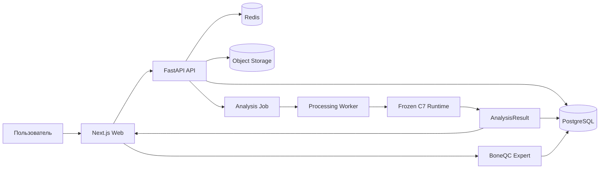
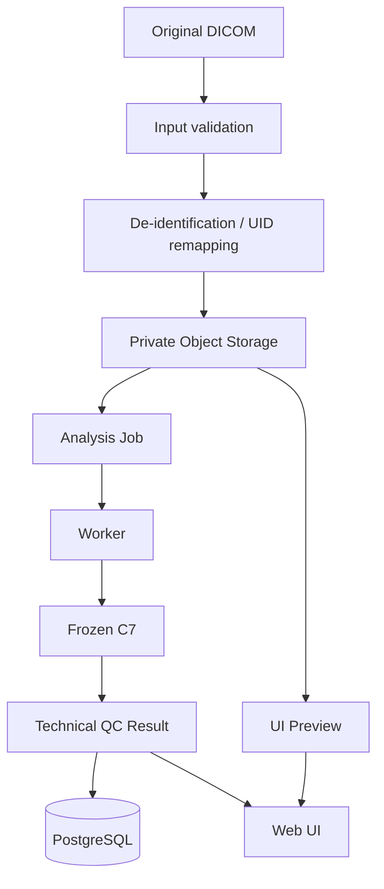
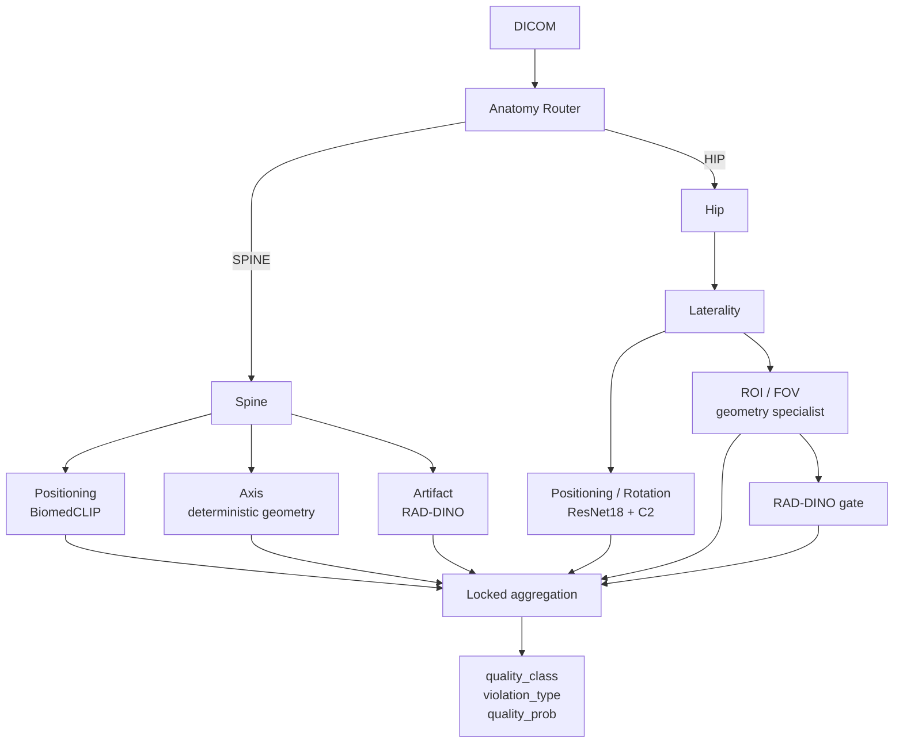
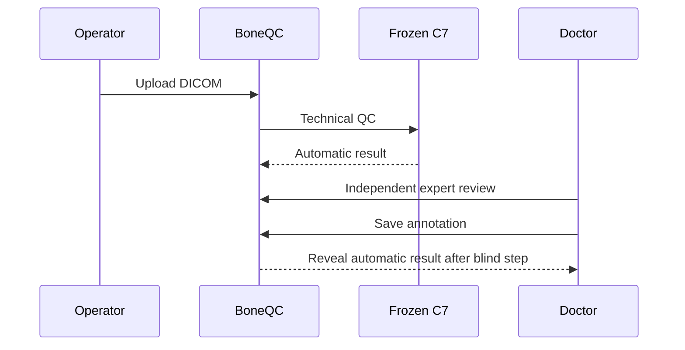
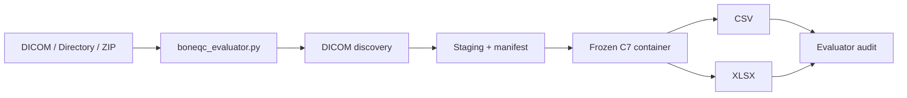

# Архитектура BoneQC

## 1. Назначение

BoneQC разделён на два независимых контура:

1. продуктовый веб-сервис;
2. конкурсный evaluator с frozen C7 runtime.

Это разделение позволяет развивать интерфейс, API, хранение данных и экспертный workflow без изменения зафиксированной ML-логики.

## 2. Общая архитектура



Web не выполняет ML inference.

## 3. Product contour

Продуктовый контур отвечает за:

- authentication;
- RBAC;
- загрузку DICOM;
- validation и privacy processing;
- хранение исследований;
- постановку асинхронных заданий;
- сохранение результатов;
- expert annotations;
- audit events;
- пользовательский интерфейс.

Основные роли продукта:

```text
ADMIN
OPERATOR
DOCTOR
```

Ролевая модель относится к продуктовому слою и не изменяет C7.

## 4. DICOM data flow



Preview PNG/JPEG используется для интерфейса и не является входом frozen C7.

ML работает с подготовленным DICOM.

## 5. Frozen C7 boundary

C7 является отдельным runtime boundary.

Во frozen contract входят:

- model selection;
- model artifacts;
- weights;
- thresholds;
- specialist decision rules;
- aggregation rules;
- output semantics;
- inference runner.

Изменения продукта не должны менять эти компоненты.

## 6. ML routing



Поддерживаемые routing labels:

```text
SPINE
LEFT_HIP
RIGHT_HIP
```

## 7. Семантика результата

Основной бинарный QC result:

```text
quality_class = 0 → PASS
quality_class = 1 → FAIL
```

`quality_class` формируется из frozen subtype decisions.

`quality_prob` является непрерывным QC score и не является самостоятельным правилом классификации.

Нельзя восстанавливать финальный класс правилом:

```text
quality_prob >= 0.5
```

Технический статус обработки хранится отдельно:

```text
processing_status = Success
processing_status = Failure
```

## 8. Processing Worker

Worker выполняет последовательность:

1. получает analysis job;
2. извлекает подготовленный DICOM;
3. вызывает frozen C7;
4. получает структурированный результат;
5. сохраняет `AnalysisResult`;
6. обновляет состояние задания.

Worker не выполняет обучение и не меняет thresholds.

## 9. Expert workflow



Экспертная оценка и automatic C7 result хранятся отдельно.

Экспертная разметка:

- не меняет C7;
- не меняет thresholds;
- не запускает автоматическое переобучение.

## 10. Competition contour



Competition contour предназначен для независимой проверки без полного web stack.

Evaluator:

- принимает file / directory / ZIP;
- обнаруживает DICOM по содержимому;
- сохраняет source paths;
- запускает exact immutable C7 image;
- выполняет inference без сети;
- формирует CSV/XLSX;
- создаёт manifest и audit;
- сохраняет `Failure`-строку для повреждённого DICOM-кандидата.

## 11. Batch HTTP API

Frozen submission package содержит локальный batch API:

```text
GET  /health/live
GET  /health/ready
POST /v1/batch
```

API использует тот же frozen C7 runner и submission adapter.

Отдельной ML-логики для HTTP API нет.

## 12. Runtime isolation

Authoritative image:

```text
ghcr.io/xaltezzarx/boneqc-c7@
sha256:d67b6a3c695a0cd495e5fd7c31e4d5f2142d13452afec4e304e2f01c9fc045d7
```

Competition inference запускается без сетевого доступа.

Runtime содержит локальные model artifacts и caches, необходимые для offline inference.

## 13. Trust boundaries

BoneQC разделяет:

```text
product data
expert annotations
frozen model artifacts
competition evaluator
```

Изменение одного контура не должно неявно изменять другой.

## 14. Аппаратный контур

Основной проверенный GPU:

```text
NVIDIA GeForce RTX 3080 10 GB
```

Дополнительно проверялся compatibility/fallback runtime на GTX 1060 6 GB.

Authoritative Linux amd64 runtime использует PyTorch/CUDA stack с поддержкой Hopper `sm_90`, поэтому архитектурно совместим с NVIDIA H200.

Физический H200 benchmark командой не выполнялся.

## 15. Clinical boundary

BoneQC выполняет технический QC DXA-исследования.

Система:

- не диагностирует остеопороз;
- не является заменой заключения врача;
- не является зарегистрированным медицинским изделием.
