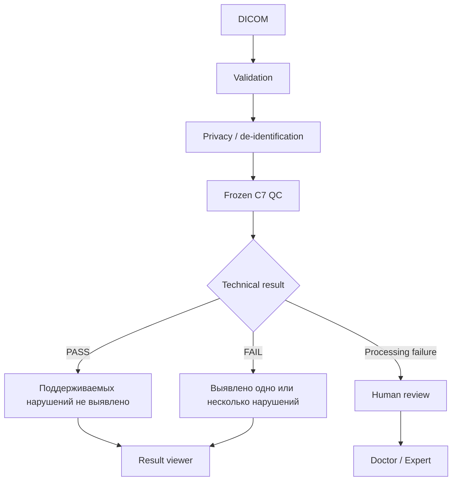
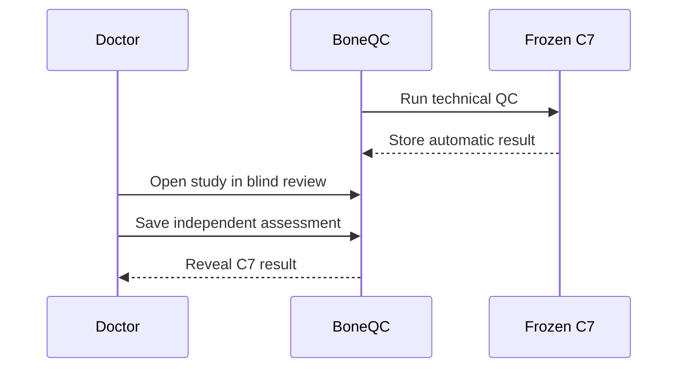

# Клинический и экспертный workflow BoneQC

## 1. Назначение

BoneQC выполняет автоматический технический контроль качества DXA-исследований до дальнейшей врачебной интерпретации.

Автоматический результат является QC-оценкой и не является диагнозом.

## 2. Поддерживаемые области

```text
SPINE
LEFT_HIP
RIGHT_HIP
```

Конкурсный кейс требует обработку:

- поясничного отдела позвоночника;
- проксимального отдела бедренной кости.

## 3. Официальные критерии: позвоночник

Для поясничного отдела позвоночника в конкурсном задании указаны следующие критерии технического качества:

- на нижнем уровне сканирования должны визуализироваться верхние края подвздошных костей;
- верхний уровень сканирования должен включать половину тела Th12;
- допустимый наклон оси позвоночника — до 5°;
- должны отсутствовать посторонние объекты, выраженные артефакты и мешающие наложения.

BoneQC отображает эти требования на три frozen subtype-направления:

```text
positioning
axis
artifact
```

Реализация C7:

```text
positioning → BiomedCLIP
axis        → deterministic geometry
artifact    → RAD-DINO
```

## 4. Официальные критерии: проксимальный отдел бедра

Для исследования проксимального отдела бедренной кости конкурсный кейс предусматривает:

- корректную визуализацию большого вертела;
- визуализацию шейки бедренной кости;
- визуализацию седалищной кости;
- отсутствие нежелательной ротации, оцениваемой по малому вертелу;
- корректную область интереса и поле обзора.

Критерий ROI/FOV в задании:

- не менее 3 см сверху от области интереса;
- не менее 3 см снизу от области интереса;
- не менее 2 см от бокового края справа или слева в зависимости от стороны бедра.

BoneQC отображает эти требования на:

```text
positioning / rotation
ROI / FOV
```

Реализация C7:

```text
positioning / rotation → ResNet18 + C2
ROI / FOV              → geometry/FOV specialist
aggregate hip QC       → geometry + RAD-DINO
```

## 5. Важное различие: критерий и model surrogate

Официальный критерий и ML-сигнал нельзя считать одним и тем же.

Например, конкурсный ROI/FOV критерий задан в сантиметрах. Для прямого физического измерения нужны корректные пространственные DICOM metadata.

Если такие metadata отсутствуют или неполны, BoneQC использует frozen geometry/FOV signal как технический surrogate и не заявляет, что во всех исследованиях буквально измеряет 3 см / 2 см.

Это ограничение должно сохраняться в документации, презентации и демонстрации.

## 6. Общий workflow



## 7. PASS

```text
quality_class = 0
```

PASS означает, что frozen C7 не выявил поддерживаемого нарушения технического качества.

PASS не означает:

- отсутствие заболевания;
- нормальную минеральную плотность костной ткани;
- отсутствие остеопороза;
- окончательное медицинское заключение.

## 8. FAIL

```text
quality_class = 1
```

FAIL означает, что C7 выявил одно или несколько поддерживаемых нарушений технического качества.

Поле `violation_type` содержит выявленный subtype или набор subtype-нарушений.

## 9. Ошибка обработки

Техническая невозможность обработать файл не должна превращаться в PASS.

В конкурсном output это отражается через:

```text
processing_status = Failure
```

Повреждённый DICOM-кандидат должен оставаться видимым в результате как отдельная failure-row.

## 10. Несколько нарушений

Одно изображение может содержать несколько нарушений одновременно.

BoneQC хранит:

- общий `quality_class`;
- один или несколько `violation_type`;
- непрерывный `quality_prob`;
- технический `processing_status`.

## 11. quality_prob

`quality_prob` — непрерывный QC score frozen C7.

Он не является:

- accuracy;
- процентом качества;
- вероятностью диагноза;
- вероятностью того, что модель права;
- заявленной клинически откалиброванной вероятностью.

Итоговый `quality_class` нельзя пересчитывать правилом:

```text
quality_prob >= 0.5
```

## 12. Врач-эксперт

Экспертный контур позволяет врачу:

- независимо определить техническое качество;
- указать тип нарушения;
- сохранить геометрическую разметку;
- добавить комментарий;
- отметить невозможность экспертной оценки.

Экспертная оценка хранится отдельно от automatic C7 result.

## 13. Blind expert workflow



При независимой проверке врач сначала формирует собственную оценку и только затем видит автоматический ответ.

Это снижает влияние ответа модели на первоначальную экспертную разметку.

## 14. Разделение результатов

Automatic result и expert annotation — разные сущности.

Экспертная разметка:

- не изменяет model selection;
- не изменяет weights;
- не изменяет thresholds;
- не вызывает автоматическое переобучение.

## 15. Входные данные

Конкурсный кейс использует DICOM без обязательной ручной разметки.

Одно исследование может содержать до трёх изображений/серий.

DICOM metadata могут использоваться системой, но решение не должно зависеть от наличия персональных данных.

## 16. Clinical boundary

BoneQC:

- выполняет технический QC;
- не анализирует BMD/T-score как диагностическое заключение;
- не диагностирует остеопороз;
- не заменяет врача;
- не является зарегистрированным медицинским изделием.

## 17. Ограничения

Текущая версия ограничена:

- заявленными анатомическими областями;
- качеством исходного DICOM;
- небольшим числом positive cases для ряда subtype;
- отсутствием внешней многоцентровой clinical validation;
- отсутствием оценки inter-reader agreement;
- неполными spatial metadata в части исследований.
