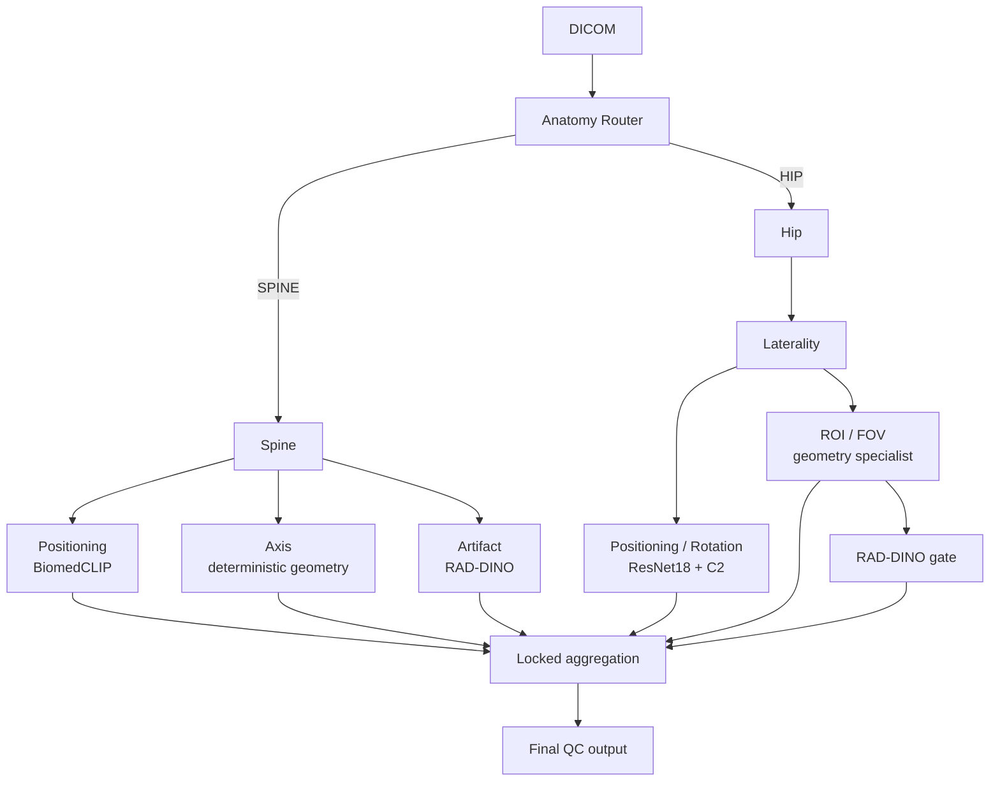
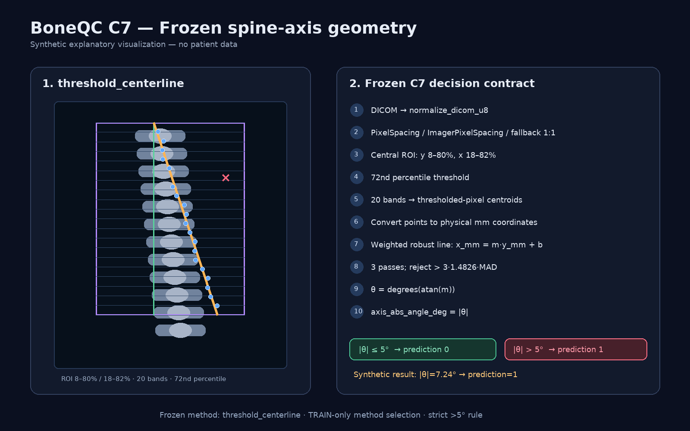
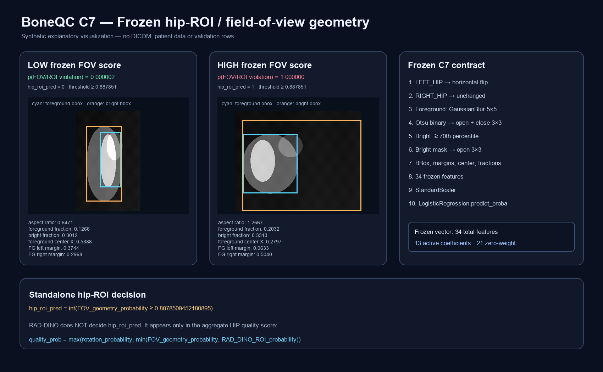

# BoneQC C7 — Model Card

## 1. Назначение

C7 — финальная frozen ML-архитектура BoneQC для автоматического технического контроля качества DXA-исследований в формате DICOM.

C7 оценивает техническое качество выполнения исследования.

C7 не предназначен для диагностики остеопороза и не заменяет медицинское заключение врача.

## 2. Поддерживаемые области

```text
SPINE
LEFT_HIP
RIGHT_HIP
```

## 3. Поддерживаемые subtype-направления

### Позвоночник

```text
positioning
axis
artifact
```

### Проксимальный отдел бедра

```text
positioning / rotation
ROI / FOV
```

## 4. C7 — это ensemble специализированных компонентов

C7 не является одним универсальным classifier.



## 5. Anatomy routing

Первый этап определяет маршрут:

```text
SPINE
LEFT_HIP
RIGHT_HIP
```

Для hip отдельно определяется laterality.

## 6. Spine positioning

Для контроля позиционирования позвоночника используется frozen BiomedCLIP representation и зафиксированный classifier.

Foundation model:

```text
microsoft/BiomedCLIP-PubMedBERT_256-vit_base_patch16_224
```

Development champion:

```text
ROC-AUC = 0.992
PR-AUC  = 0.925
```

Это development model-selection metrics, а не независимая оценка всей системы.

## 7. Spine axis

Контроль оси использует детерминированный геометрический сигнал `|axis_angle_deg|`.

На development data этот сигнал превзошёл проверенные RAD-DINO и BiomedCLIP alternatives по ranking metrics.

Development:

```text
ROC-AUC = 0.859375
PR-AUC  = 0.381487
```

В конкурсном кейсе допустимый наклон оси — до 5°.



## 8. Spine artifact

Для контроля посторонних объектов и выраженных артефактов используется RAD-DINO / DINOv2-based representation и frozen classifier.

Development:

```text
ROC-AUC = 0.848485
PR-AUC  = 0.690919
```

## 9. Hip positioning / rotation

Используется frozen комбинация:

```text
ResNet18 + C2 center-medial signal
```

Development:

```text
ROC-AUC = 0.826828
PR-AUC  = 0.647193
```

Компонент связан с оценкой positioning/rotation и не является диагностическим classifier.

## 10. Hip ROI / FOV

Standalone ROI decision использует geometry/FOV specialist.

Development:

```text
ROC-AUC = 0.836522
PR-AUC  = 0.545333
```

RAD-DINO дополнительно используется внутри aggregate hip-quality rule.

Aggregate hip-quality development metrics:

```text
ROC-AUC = 0.857541
PR-AUC  = 0.729456
```



Физический критерий конкурсного задания и model signal необходимо различать: C7 не заявляет прямое измерение сантиметров для каждого файла при отсутствии необходимых spatial metadata.

## 11. Формирование результата

```text
quality_class = 0 → PASS
quality_class = 1 → FAIL
```

`quality_class` формируется из frozen subtype decisions и aggregation rules.

## 12. quality_prob

`quality_prob` — непрерывный QC score.

Он не является:

- accuracy;
- процентом качества исследования;
- вероятностью диагноза;
- вероятностью корректности модели;
- заявленной клинически откалиброванной вероятностью.

Финальный класс нельзя восстанавливать правилом:

```text
quality_prob >= 0.5
```

## 13. violation_type

`violation_type` формируется согласованно с frozen subtype decisions.

Одно изображение может иметь несколько типов нарушений.

## 14. processing_status

Технический статус обработки отделён от QC result.

```text
Success
Failure
```

Processing failure не должен интерпретироваться как PASS.

## 15. Frozen policy

До one-time blind validation были зафиксированы:

- model selection;
- model artifacts;
- weights;
- thresholds;
- output semantics;
- inference runner.

После validation C7 не перенастраивался по её результатам.

## 16. One-time validation

Validation set:

```text
49 изображений
20 исследований
```

Overall QC:

| Метрика | Значение |
|---|---:|
| Sensitivity | 0.5000 |
| Specificity | 0.8571 |
| Balanced accuracy | 0.6786 |
| F1 | 0.5385 |
| ROC-AUC | 0.7143 |
| PR-AUC | 0.6567 |

Confusion matrix:

```text
TP = 7
FP = 5
TN = 30
FN = 7
```

Study-cluster bootstrap 95% CI:

| Метрика | 95% CI |
|---|---|
| Sensitivity | 0.2500–0.8750 |
| Specificity | 0.7419–0.9556 |
| F1 | 0.3000–0.7586 |
| Balanced accuracy | 0.5377–0.8683 |
| ROC-AUC | 0.4907–0.9460 |
| PR-AUC | 0.3859–0.8666 |

95% CI не означает 95% accuracy.

## 17. Subtype validation

Из-за малого числа positive cases subtype-метрики необходимо читать вместе с `n` и количеством positives.

| Subtype | n | positives | F1 | ROC-AUC |
|---|---:|---:|---:|---:|
| Spine positioning | 19 | 1 | 0.0000 | 0.8889 |
| Spine axis | 19 | 2 | 0.5000 | 0.8824 |
| Spine artifact | 19 | 3 | 0.4000 | 0.7292 |
| Hip positioning / rotation | 30 | 7 | 0.6154 | 0.8137 |
| Hip ROI / FOV | 30 | 2 | 0.3333 | 0.9286 |

Subtype macro-F1:

```text
0.3697
```

Эти значения имеют высокую статистическую неопределённость из-за малого числа positives.

## 18. C8 challengers

После C7 исследовались независимые challenger approaches:

- Noisy-OR;
- logistic stacker;
- score-only alternative;
- direct overall head;
- patch-token RAD-DINO.

Ни один вариант не прошёл promotion gate.

```text
NO_C8_PROMOTION_KEEP_C7
```

C8 не использовался для ретроспективного исправления C7.

## 19. Authoritative runtime

```text
ghcr.io/xaltezzarx/boneqc-c7@
sha256:d67b6a3c695a0cd495e5fd7c31e4d5f2142d13452afec4e304e2f01c9fc045d7
```

Runtime выполняет inference offline при наличии frozen artifacts.

## 20. GPU parity

Frozen 49-case RTX/GTX replay:

```text
semantic mismatches = 0
class flips         = 0
```

Небольшие различия `quality_prob` не меняли финальный класс.

Compatibility runtime не является новой моделью.

## 21. H200 compatibility

Authoritative Linux amd64 runtime использует PyTorch 2.14.0 + CUDA 13.0 stack с поддержкой `sm_90`.

NVIDIA H200 относится к Hopper / `sm_90`, поэтому runtime архитектурно совместим с H200.

Физический benchmark на H200 командой не выполнялся.

## 22. Ограничения

C7 имеет ограничения:

- малое число positive cases для ряда subtype;
- class imbalance;
- поддержка только заявленных anatomical regions;
- отсутствие внешней многоцентровой validation;
- отсутствие оценки inter-reader agreement;
- часть physical criteria опирается на surrogate signals при неполных metadata;
- prototype validation не эквивалентна медицинской сертификации.

## 23. Связанные документы

- [Validation](VALIDATION.md)
- [Dataset and Splits](DATASET_AND_SPLITS.md)
- [Experiment History](EXPERIMENT_HISTORY.md)
- [Solution Overview](../SOLUTION_OVERVIEW.md)
