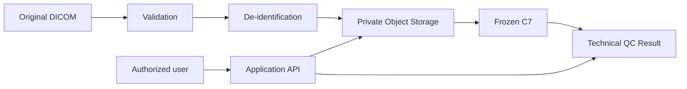

# Конфиденциальность и безопасность BoneQC

## 1. Назначение

BoneQC работает с медицинскими DICOM-файлами, поэтому архитектура учитывает:

- минимизацию данных;
- privacy processing;
- разграничение доступа;
- разделение доверенных контуров;
- локальный frozen runtime;
- fail-safe error semantics.

## 2. Trust model



## 3. DICOM validation

До дальнейшей обработки проверяется возможность корректной работы с input.

Повреждённый DICOM не должен автоматически интерпретироваться как PASS.

В competition evaluator повреждённый DICOM-кандидат сохраняется как отдельная output-row с:

```text
processing_status = Failure
```

## 4. Metadata de-identification

Перед использованием подготовленного исследования в продуктовом ML-контуре выполняются:

- удаление ненужных identifying fields;
- замена внутренних identifiers;
- UID remapping;
- минимизация metadata.

DICOM metadata могут использоваться системой, однако решение не должно зависеть от наличия персональных данных.

## 5. Private tags

Private DICOM tags могут содержать vendor-specific или identifying information.

Неизвестные private tags нельзя автоматически считать безопасными для публикации.

## 6. Pixel Data

Удаление metadata не гарантирует отсутствие информации внутри изображения.

Отдельный риск:

- burned-in annotations;
- текст внутри pixel data;
- визуально встроенные identifiers.

Этот риск должен анализироваться отдельно от metadata cleaning.

## 7. Preview boundary

Preview используется для UI.

Preview не является ML input frozen C7.

При этом preview остаётся медицинским изображением и должно защищаться так же, как исходный DICOM.

## 8. Object Storage

Object Storage относится к trusted internal contour.

Он не должен предоставлять анонимный public access к medical objects.

## 9. PostgreSQL и Redis

PostgreSQL и Redis являются внутренними инфраструктурными сервисами.

Они не должны быть напрямую доступны из публичного internet contour.

## 10. RBAC

Основные роли:

```text
ADMIN
OPERATOR
DOCTOR
```

Проверка доступа выполняется на backend, а не только в frontend.

## 11. Automatic vs expert data

Automatic C7 result и expert annotations хранятся отдельно.

Expert annotation:

- не подменяет automatic result;
- не меняет frozen model;
- не меняет thresholds;
- не запускает неявное retraining.

## 12. Secrets

Реальные secrets не должны храниться в Git.

К ним относятся:

- passwords;
- tokens;
- session secrets;
- gateway credentials;
- private keys.

## 13. Environment files

Файлы с real environment values должны иметь ограниченные права доступа и не попадать в публичный repository.

## 14. Logging

Application logs не должны намеренно включать:

- ФИО пациента;
- source patient identifiers;
- access tokens;
- production secrets;
- полный DICOM payload.

## 15. Audit trail

Security/audit events должны храниться отдельно от обычных application logs.

Audit trail предназначен для фиксации действий, а не для копирования medical content.

## 16. Competition runtime isolation

Competition runtime содержит локальные frozen artifacts.

Во время inference:

- сеть отключена;
- weights не скачиваются;
- external AI API не используются;
- thresholds не меняются;
- model selection не меняется.

## 17. Corrupted input handling

Evaluator различает:

- корректный DICOM;
- явно DICOM-подобный повреждённый input;
- обычный non-DICOM файл.

Для явно DICOM-подобного повреждённого input результат не должен молча исчезать.

Это является частью fail-safe поведения evaluator.

## 18. ZIP safety

Competition evaluator применяет ограничения к ZIP input:

- запрещает path traversal;
- запрещает symbolic-link entries;
- не принимает encrypted entries;
- ограничивает количество файлов;
- ограничивает суммарный uncompressed size.

## 19. Data minimization

Храниться должны только данные, необходимые для:

- работы сервиса;
- воспроизводимости результата;
- audit;
- разрешённых expert workflows.

## 20. Retention

Универсальная retention policy не задаётся публичным competition repository.

Срок хранения должен определяться режимом эксплуатации и политикой организации.

## 21. Backup

Backup medical data требует тех же мер защиты, что и primary storage.

## 22. Public repository boundary

В публичном repository не должны находиться:

- реальные medical DICOM;
- production secrets;
- private keys;
- patient personal data;
- закрытые credentials.

## 23. Compliance boundary

BoneQC — исследовательский прототип.

Документация не заявляет соответствие конкретному медицинскому regulatory framework или статус зарегистрированного медицинского изделия.

## 24. Clinical boundary

Security measures не меняют назначение BoneQC: система выполняет технический QC и не ставит диагноз.
